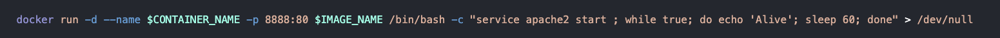
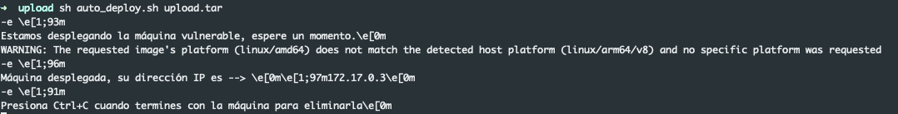
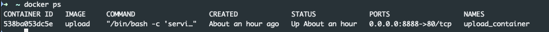
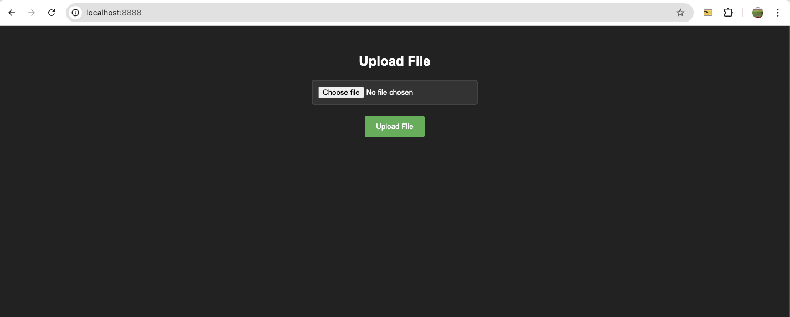

# 📦 Tutorial de com llançar una màquina de DockerLabs

### 1. Descarregar el fitxer i descomprimir-lo

### 2. Donem permisos d'execució al fitxer auto_deploy.sh

```bash
chmod +x auto_deploy.sh
```

### 3. Comprovem si el fitxer auto_deploy.sh quan executa el docker run està exposant els ports

Hauria de contindre el flag -p 8888:80




### 4. Donem permisos d'execució al fitxer auto_deploy.sh

```bash
chmod +x auto_deploy.sh
```

### 5. Llancem la màquina



### 6. Comprovem si docker està exposant el port



### 7. Accedim a l'aplicació web a través d'un navegador

